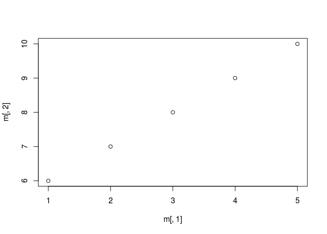

Getting set up
--------------

1.  WiFi
2.  Open your browser to 172.16.128.140:8787
3.  Log in with your MICe credentials
4.  Set you paths:

``` r
Sys.setenv(PATH = "/axiom2/projects/software/arch/linux-precise/bin/:/OGS/bin/linux-x64:/usr/local/sbin:/usr/local/bin:/usr/sbin:/usr/bin:/sbin:/bin:/usr/games"
           , PYTHONPATH = "/axiom2/projects/software/arch/linux-precise/python/"
           , LD_LIBRARY_PATH = "/axiom2/projects/software/arch/linux-precise/lib/:/axiom2/projects/software/arch/linux-precise/lib/InsightToolkit/")
```

Intro To R
----------

R is a statistical computing environment and programming language designed by for statistics by statisticians.

Rstudio Interface
-----------------

-   Rstudio server, available through a web interface
-   Panes for
    1.  Scripts
    2.  R console
    3.  Environment, History, Git
    4.  Help, Plots, and Packages

The R Console
-------------

-   R is an interpretted programming language (no compilation necessary)
-   Frequently engaged via an interactive console (REPL)
-   Type commands, get quick feedback
-   Useful as a calculator

First commands
--------------

Let's try asking R some simple math problems

``` r
6 * 12
```

    ## [1] 72

Entering the above command asks the R interpretter to read the command, evaluate the code, and print the results to the console.

R has many basic operators

``` r
6 + 12 
```

    ## [1] 18

``` r
18 / 3
```

    ## [1] 6

``` r
2^3
```

    ## [1] 8

``` r
2^(-1/3)
```

    ## [1] 0.7937005

``` r
log(4)
```

    ## [1] 1.386294

R functions are required to provide documentation about what they do:

``` r
?log
```

R can also work naturally with text data

``` r
"Hi There!"
```

    ## [1] "Hi There!"

Variables
---------

R can remember the results of computations and these can be used later. In R we use the assignment operator `<-` to assign values to a variable name

``` r
a <- 5
```

We can then use those variables later

``` r
a * 10
```

    ## [1] 50

Names can be almost anything you want, but they need to start with a letter, but may contain the special characters `_` and `.` as well as numbers

Intrepretter Recap
------------------

-   R is a computing environment and interpretted programming language
-   R provides a **R**ead **E**val **P**rint **L**oop (REPL)
-   R works great as a command line calculator
-   R allows you to assign values to variables

R Data Types
------------

To get a feel for R it's useful to know some of the common ways R stores information. Let's start with the simplest.

Vectors
-------

The most fundamental type of data in R is the **vector**. A vector is a one dimensional array of information.

We'll take the R provided vector `LETTERS` as an example.

Input the following line and press enter

``` r
LETTERS
```

    ##  [1] "A" "B" "C" "D" "E" "F" "G" "H" "I" "J" "K" "L" "M" "N" "O" "P" "Q"
    ## [18] "R" "S" "T" "U" "V" "W" "X" "Y" "Z"

When interacting with the console, R will print the value of any computation, you can also print explicitly.

``` r
print(LETTERS)
```

    ##  [1] "A" "B" "C" "D" "E" "F" "G" "H" "I" "J" "K" "L" "M" "N" "O" "P" "Q"
    ## [18] "R" "S" "T" "U" "V" "W" "X" "Y" "Z"

The `print` command comes in handy when you want to print intermediate results of a computation.

Creating your own vectors
-------------------------

To construct a vector, R provides the `c` function, to construct a vector from elements.

``` r
c(1,2,3,4,5)
```

    ## [1] 1 2 3 4 5

R also provides a short hand for creating numerical sequences

``` r
1:5
```

    ## [1] 1 2 3 4 5

Subsetting
----------

Sometimes you only want specific elements from a vector. The way to do this in R is the `[` operator.

``` r
LETTERS[5]
```

    ## [1] "E"

``` r
LETTERS[c(2,3)]
```

    ## [1] "B" "C"

``` r
LETTERS[-(4:25)]
```

    ## [1] "A" "B" "C" "Z"

An important note - R indexes from 1. This is an oddity for modern programming languages, most index from zero.

### No Scalars

If you experience with other programming languages you might expect R to make the distinction between vectors and their single element counterparts. R does not make this distinction. An element of a vector is just a one element vector

``` r
LETTERS[1][1][1][1]
```

    ## [1] "A"

Looping
-------

Often you will want to perform some computation for each element of an R vector, the simplest way to accomplish this is with a `for` loop.

``` r
for(i in 1:10){
    print(i)
}
```

    ## [1] 1
    ## [1] 2
    ## [1] 3
    ## [1] 4
    ## [1] 5
    ## [1] 6
    ## [1] 7
    ## [1] 8
    ## [1] 9
    ## [1] 10

Recap Vectors
-------------

1.  Vectors are 1D arrays of elements
2.  Vectors can be made by `c`onstructing them
3.  Vectors can be subset with `[` by single elements, vectors of elements, and removal
4.  R indexes from 1
5.  There are no scalars
6.  Vector elements can be looped over with `for(var in vec)`

Matrices
--------

Matrices are the 2 dimensional version of R vectors. In R matrices are essentially vectors with an extra attribute indicating the dimensions of the matrix. Matrices can be constructed with the `matrix` function.

``` r
m <- matrix(1:10, ncol = 2, nrow = 5)
m
```

    ##      [,1] [,2]
    ## [1,]    1    6
    ## [2,]    2    7
    ## [3,]    3    8
    ## [4,]    4    9
    ## [5,]    5   10

Matrices can be subset

``` r
m[5,1]
```

    ## [1] 5

Rows and columns can be extracted by leaving index arguments empty

``` r
m[1,]
```

    ## [1] 1 6

``` r
m[,1]
```

    ## [1] 1 2 3 4 5

Matrices can also be subset just like vectors

``` r
m[5]
```

    ## [1] 5

Information about the matrix can be extracted

``` r
nrow(m)
```

    ## [1] 5

``` r
ncol(m)
```

    ## [1] 2

``` r
length(m)
```

    ## [1] 10

``` r
dim(m)
```

    ## [1] 5 2

Recap Matrices
--------------

1.  Matrices can be constructed with the `matrix` function
2.  Matrices can be subset by rows and columns `[,]`
3.  Matrices can be subset like vectors `[`
4.  Matrices have functions that tell you about their structure

A Plot
------

R makes plotting very easy, it has a multipurpose `plot`, we don't have time to cover plotting in much detail, but a simple scatter plot can be produced with

``` r
plot(m[,1], m[,2])
```



Lists
-----

The second most fundamental data type in R is the list. Vectors are collections of elements with a given type (like numbers or letters), whereas lists are collections of whatever you'd like.

Lists can be made with the `list` function

``` r
l <- list(a = 5, b = "words", c = list())
l
```

    ## $a
    ## [1] 5
    ## 
    ## $b
    ## [1] "words"
    ## 
    ## $c
    ## list()

Lists can be subset like vectors and assigned like vectors

``` r
l[2:3] <- list("ardvark", 10)
l
```

    ## $a
    ## [1] 5
    ## 
    ## $b
    ## [1] "ardvark"
    ## 
    ## $c
    ## [1] 10

The subsetting operator (`[`) for lists returns a list containing the selected elements. To get a specific element out a list, you need the `[[` operator.

``` r
l[2]
```

    ## $b
    ## [1] "ardvark"

``` r
l[[2]]
```

    ## [1] "ardvark"

Lists can contain both named and unnamed elements. Named elements can be accessed directly with the `$` operator.

``` r
l$a
```

    ## [1] 5

Lists Recap
-----------

1.  Elements of vectors can be assigned in place
2.  Lists are collections of arbitrary elements
3.  Lists can be created with the `list` function with either named or unnamed elements
4.  Lists can be subset and assigned like vectors
5.  List elements can be accessed with `[[` operators
6.  Named list elements can be accessed with the `$` operator

Data Frames
-----------

The next data type to cover and one of the most important is the `data.frame`. Data frames are analogous to a sheet in excel or a table in a database. They are rectangular arrays of data, each column must have the same number of elements. Each column can contain elements of only one type, but data may differ in type across the rows. In R a data frame is a special case of a list of vectors.

``` r
frame <- data.frame(subject = 1:20,
                    group = sample(c("A", "B"), 20, replace = TRUE),
                    measurement = rnorm(20))

frame
```

    ##    subject group  measurement
    ## 1        1     A  0.979154796
    ## 2        2     A  0.119153861
    ## 3        3     B -0.495778788
    ## 4        4     B  1.345440901
    ## 5        5     A -0.002071211
    ## 6        6     B -2.286421294
    ## 7        7     B -1.033599826
    ## 8        8     B -0.262066355
    ## 9        9     A -1.058245758
    ## 10      10     A  1.301692202
    ## 11      11     B -0.650802526
    ## 12      12     A -2.680014564
    ## 13      13     B  0.227896971
    ## 14      14     A  0.532120890
    ## 15      15     A -1.089720209
    ## 16      16     B -0.399794987
    ## 17      17     B  1.041836441
    ## 18      18     B  1.953158625
    ## 19      19     A  2.393083867
    ## 20      20     A -0.255733947

*Note the bonus functions `sample` (choosing random elements from a vector), and `rnorm` (normally distributed random numbers), don't worry about them yet*

I can treat my `data.frame` exactly like the `list` that it is, and extract the 'measurement' column

``` r
frame$measurement
```

    ##  [1]  0.979154796  0.119153861 -0.495778788  1.345440901 -0.002071211
    ##  [6] -2.286421294 -1.033599826 -0.262066355 -1.058245758  1.301692202
    ## [11] -0.650802526 -2.680014564  0.227896971  0.532120890 -1.089720209
    ## [16] -0.399794987  1.041836441  1.953158625  2.393083867 -0.255733947

Observe that measurment is in fact a vector of numbers.

Data frames can also be subset by row and columns simultaneously to extract element.

``` r
frame[5, "group"]
```

    ## [1] A
    ## Levels: A B

And we can see that we can pull values out of the data frame. This notation can also be used to get entire rows and columns

``` r
frame[5,]
```

    ##   subject group  measurement
    ## 5       5     A -0.002071211

``` r
frame[,2]
```

    ##  [1] A A B B A B B B A A B A B A A B B B A A
    ## Levels: A B

New columns can be added by subset assignment

``` r
frame$test <- rnorm(10)

frame
```

    ##    subject group  measurement        test
    ## 1        1     A  0.979154796 -0.11378755
    ## 2        2     A  0.119153861 -0.83617062
    ## 3        3     B -0.495778788 -0.03147758
    ## 4        4     B  1.345440901  0.61220956
    ## 5        5     A -0.002071211  0.04371399
    ## 6        6     B -2.286421294 -0.22257207
    ## 7        7     B -1.033599826 -0.33148176
    ## 8        8     B -0.262066355  0.74918693
    ## 9        9     A -1.058245758  0.02747068
    ## 10      10     A  1.301692202  0.74311031
    ## 11      11     B -0.650802526 -0.11378755
    ## 12      12     A -2.680014564 -0.83617062
    ## 13      13     B  0.227896971 -0.03147758
    ## 14      14     A  0.532120890  0.61220956
    ## 15      15     A -1.089720209  0.04371399
    ## 16      16     B -0.399794987 -0.22257207
    ## 17      17     B  1.041836441 -0.33148176
    ## 18      18     B  1.953158625  0.74918693
    ## 19      19     A  2.393083867  0.02747068
    ## 20      20     A -0.255733947  0.74311031

And columns can be erased by setting the column to `NULL`, a special R object indicating nothingness.

``` r
frame$test <- NULL

frame
```

    ##    subject group  measurement
    ## 1        1     A  0.979154796
    ## 2        2     A  0.119153861
    ## 3        3     B -0.495778788
    ## 4        4     B  1.345440901
    ## 5        5     A -0.002071211
    ## 6        6     B -2.286421294
    ## 7        7     B -1.033599826
    ## 8        8     B -0.262066355
    ## 9        9     A -1.058245758
    ## 10      10     A  1.301692202
    ## 11      11     B -0.650802526
    ## 12      12     A -2.680014564
    ## 13      13     B  0.227896971
    ## 14      14     A  0.532120890
    ## 15      15     A -1.089720209
    ## 16      16     B -0.399794987
    ## 17      17     B  1.041836441
    ## 18      18     B  1.953158625
    ## 19      19     A  2.393083867
    ## 20      20     A -0.255733947

Data frame Recap
----------------

1.  Data frames are rectangular arrays of data
2.  A data frame is a list of vectors of all the same length
3.  Each column vector can have its own type
4.  Data frame can be created with the `data.frame` function
5.  List style subsetting works for data frames (`[`, `[[`, `$`)
6.  Array style subsetting works for data frame (`[,]`)
7.  Columns can be added by subset assignment
8.  Columns can be removed by assigning `NULL` to a column

Finally, An Example
-------------------

Before we start we need some data to look at. Creating data frames in R is a pain, so we're going to need a function to read in data. The most common type of data you will access is in the `csv` format.

To get some example data, we will use the `read.csv` function, with no added arguments. This is only possible becasue the csv is nicely formatted. Many hours can be spent learning the ins and outs of reading data.frames into R, so I will gloss over this problem.

``` r
ex <- 
  read.csv("/hpf/largeprojects/MICe/chammill/presentations/summer_school2017/intro_to_R/fixed_datatable_IRdose.csv", 
           stringsAsFactors = FALSE)
```

*Note there is one added argument - `stringsAsFactors`. Remembering to set this to `FALSE` will save many headaches. In fact it is a good practice to run `options(stringsAsFactors = FALSE)` at the beginning of R session/script*

A useful tool for getting a sense of what's in any R object is the `str` function. This tells you about the structure of the object.

``` r
str(ex)
```

    ## 'data.frame':    41 obs. of  10 variables:
    ##  $ MouseID            : chr  "4.1.La" "4.1.Lb" "4.1.Lac" "4.1.Ra" ...
    ##  $ Sex                : chr  "M" "M" "M" "F" ...
    ##  $ Dose               : int  0 3 7 0 3 5 0 3 5 7 ...
    ##  $ Litter             : num  4.1 4.1 4.1 4.1 4.1 4.1 4.2 4.2 4.2 4.2 ...
    ##  $ Coil               : int  1 2 3 4 5 6 7 8 9 10 ...
    ##  $ ScanDate           : chr  "03-Dec-12" "03-Dec-12" "03-Dec-12" "03-Dec-12" ...
    ##  $ original_mnc       : chr  "/projects/egerek/lbernas/Irradiation_behaviour_project/MR_data/distortion_corrected/fixed_03dec12.1.jan2011_distortion_correcte"| __truncated__ "/projects/egerek/lbernas/Irradiation_behaviour_project/MR_data/distortion_corrected/fixed_03dec12.2.jan2011_distortion_correcte"| __truncated__ "/projects/egerek/lbernas/Irradiation_behaviour_project/MR_data/distortion_corrected/fixed_03dec12.3.jan2011_distortion_correcte"| __truncated__ "/projects/egerek/lbernas/Irradiation_behaviour_project/MR_data/distortion_corrected/fixed_03dec12.4.jan2011_distortion_correcte"| __truncated__ ...
    ##  $ Jacobfile_scaled   : chr  "/projects/moush/lbernas/Irradiation_behaviour_project/fixed_build_masked_23mar13_processed/fixed_03dec12.1.jan2011_distortion_c"| __truncated__ "/projects/moush/lbernas/Irradiation_behaviour_project/fixed_build_masked_23mar13_processed/fixed_03dec12.2.jan2011_distortion_c"| __truncated__ "/projects/moush/lbernas/Irradiation_behaviour_project/fixed_build_masked_23mar13_processed/fixed_03dec12.3.jan2011_distortion_c"| __truncated__ "/projects/moush/lbernas/Irradiation_behaviour_project/fixed_build_masked_23mar13_processed/fixed_03dec12.4.jan2011_distortion_c"| __truncated__ ...
    ##  $ Jacobfile_scaled0.2: chr  "/projects/moush/lbernas/Irradiation_behaviour_project/fixed_build_masked_23mar13_processed/fixed_03dec12.1.jan2011_distortion_c"| __truncated__ "/projects/moush/lbernas/Irradiation_behaviour_project/fixed_build_masked_23mar13_processed/fixed_03dec12.2.jan2011_distortion_c"| __truncated__ "/projects/moush/lbernas/Irradiation_behaviour_project/fixed_build_masked_23mar13_processed/fixed_03dec12.3.jan2011_distortion_c"| __truncated__ "/projects/moush/lbernas/Irradiation_behaviour_project/fixed_build_masked_23mar13_processed/fixed_03dec12.4.jan2011_distortion_c"| __truncated__ ...
    ##  $ Jacobfile_scaled0.5: chr  "/projects/moush/lbernas/Irradiation_behaviour_project/fixed_build_masked_23mar13_processed/fixed_03dec12.1.jan2011_distortion_c"| __truncated__ "/projects/moush/lbernas/Irradiation_behaviour_project/fixed_build_masked_23mar13_processed/fixed_03dec12.2.jan2011_distortion_c"| __truncated__ "/projects/moush/lbernas/Irradiation_behaviour_project/fixed_build_masked_23mar13_processed/fixed_03dec12.3.jan2011_distortion_c"| __truncated__ "/projects/moush/lbernas/Irradiation_behaviour_project/fixed_build_masked_23mar13_processed/fixed_03dec12.4.jan2011_distortion_c"| __truncated__ ...

Here we can see there is are 10 columns, some of which are numeric, some strings (character). Pardon the ugly printing of the filenames.

You can also get a sense for what's in a data frame by looking at the column names

``` r
names(ex)
```

    ##  [1] "MouseID"             "Sex"                 "Dose"               
    ##  [4] "Litter"              "Coil"                "ScanDate"           
    ##  [7] "original_mnc"        "Jacobfile_scaled"    "Jacobfile_scaled0.2"
    ## [10] "Jacobfile_scaled0.5"

First Statistics
----------------

R comes with a rich library of functions that tell you interesting properties about vectors.

Here's a quick assortment of some summary functions built in to R

``` r
length(ex$Dose)
```

    ## [1] 41

``` r
mean(ex$Dose)
```

    ## [1] 3.731707

``` r
median(ex$Dose)
```

    ## [1] 3

``` r
sd(ex$Dose)
```

    ## [1] 2.588671

``` r
min(ex$Dose)
```

    ## [1] 0

``` r
range(ex$Dose)
```

    ## [1] 0 7

``` r
summary(ex$Dose)
```

    ##    Min. 1st Qu.  Median    Mean 3rd Qu.    Max. 
    ##   0.000   3.000   3.000   3.732   5.000   7.000

``` r
unique(ex$Sex)
```

    ## [1] "M" "F"

``` r
table(ex$Sex)
```

    ## 
    ##  F  M 
    ## 22 19

A Simple Linear Model
---------------------

For a toy example let's test the hypothesis that the dose adminstered to the mice doesn't depend on sex.

R provides a convenient model specification format, often called the formula interface:

&lt;response&gt; ~ &lt;covariate 1&gt; + &lt;covariate 2&gt;

``` r
lmod <- lm(Dose ~ Sex, data = ex)

lmod
```

    ## 
    ## Call:
    ## lm(formula = Dose ~ Sex, data = ex)
    ## 
    ## Coefficients:
    ## (Intercept)         SexM  
    ##      3.5455       0.4019

``` r
summary(lmod)
```

    ## 
    ## Call:
    ## lm(formula = Dose ~ Sex, data = ex)
    ## 
    ## Residuals:
    ##     Min      1Q  Median      3Q     Max 
    ## -3.9474 -0.9474 -0.5455  1.4545  3.4545 
    ## 
    ## Coefficients:
    ##             Estimate Std. Error t value Pr(>|t|)    
    ## (Intercept)   3.5455     0.5572   6.363 1.62e-07 ***
    ## SexM          0.4019     0.8185   0.491    0.626    
    ## ---
    ## Signif. codes:  0 '***' 0.001 '**' 0.01 '*' 0.05 '.' 0.1 ' ' 1
    ## 
    ## Residual standard error: 2.614 on 39 degrees of freedom
    ## Multiple R-squared:  0.006144,   Adjusted R-squared:  -0.01934 
    ## F-statistic: 0.2411 on 1 and 39 DF,  p-value: 0.6262

Advanced topics
---------------

Feel free to ask me about any of the following over the course of the week

-   Packages
-   Writing functions
-   Functional programming tools (apply family)
-   Tidyverse
-   Plotting, for real
